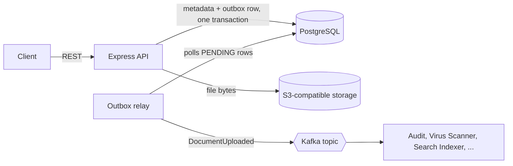

# Document Service

> **Resolve, Task 8.** Stores case documents and their version history, keeps
> the file bytes in S3-compatible storage, and announces new uploads to the
> rest of the platform through Kafka.


## Table of contents

- [What it does](#what-it-does)
- [Architecture](#architecture)
- [Quick start](#quick-start)
- [Configuration](#configuration)
- [API reference](#api-reference)
- [Error codes](#error-codes)
- [Kafka events](#kafka-events)
- [Project structure](#project-structure)
- [Standalone development and integration stubs](#standalone-development-and-integration-stubs)
- [Design decisions](#design-decisions)
- [Testing](#testing)
- [Troubleshooting](#troubleshooting)
- [Known gaps and roadmap](#known-gaps-and-roadmap)

## What it does

- **Upload** a file to a case. Metadata goes to Postgres, the bytes go to S3-compatible storage.
- **Version** a document. Every version keeps its own file, filename, and checksum.
- **List, view, and download** documents and any specific version, always scoped to the caller's tenant and case.
- **Protect uploads** with a size limit and a blocked-MIME-type list.
- **Retry-safe uploads** through `Idempotency-Key`, so a repeated request never creates a duplicate.
- **Publish events.** Each new document produces a `DocumentUploaded` event through a transactional outbox, so no event is lost and no upload depends on Kafka being up.

## Architecture



**Upload flow**

1. Validate the file (size, MIME type) and the `Idempotency-Key`.
2. Upload the bytes to S3. If this fails, nothing touches Postgres.
3. In one Postgres transaction: insert the `documents` row, the `document_versions` row (version 1), and an `outbox_events` row.
4. Return `201`. The relay publishes the event to Kafka a few seconds later.

## Quick start

**Prerequisites:** Node.js 20+, Docker Desktop.

```bash
# 1. Start Postgres, S3-compatible storage, and Kafka
docker-compose up -d

# 2. Create the tables (run in order)
docker exec -i document-service-postgres psql -U resolve -d documentdb < migrations/001_init.sql
docker exec -i document-service-postgres psql -U resolve -d documentdb < migrations/002_idempotency_keys.sql
docker exec -i document-service-postgres psql -U resolve -d documentdb < migrations/003_document_versions_filename.sql
docker exec -i document-service-postgres psql -U resolve -d documentdb < migrations/004_outbox_relay_indexes.sql

# 3. Install and configure
npm install
cp .env.example .env

# 4. Run
node src/index.js
```

On PowerShell, `<` redirection doesn't work. Pipe the file instead:
`Get-Content migrations\001_init.sql | docker exec -i document-service-postgres psql -U resolve -d documentdb`

Then open:

- Health check: http://localhost:3000/health
- Swagger UI: http://localhost:3000/api-docs

### Local infrastructure

| Container | Purpose | Host port |
|---|---|---|
| `document-service-postgres` | Database `documentdb` | `5433` |
| `document-service-s3` | SeaweedFS, S3-compatible storage | `8333` |
| `document-service-kafka` | Redpanda, Kafka-compatible broker | `9092` |

Postgres uses `5433` so it doesn't clash with another service's Postgres on `5432`.
SeaweedFS replaces MinIO, which stopped publishing free Docker images.

## Configuration

Copy `.env.example` to `.env`. The server reads it once at startup, so **restart after any change**.

| Variable | Purpose | Example |
|---|---|---|
| `DB_HOST`, `DB_PORT`, `DB_NAME`, `DB_USER`, `DB_PASSWORD` | Postgres connection | `localhost`, `5433`, `documentdb` |
| `S3_ENDPOINT` | Object storage URL | `http://localhost:8333` |
| `S3_ACCESS_KEY`, `S3_SECRET_KEY` | Storage credentials | |
| `S3_BUCKET` | Bucket for all documents | `resolve-documents` |
| `S3_REGION` | Required by the AWS SDK even for non-AWS storage | `us-east-1` |
| `MAX_UPLOAD_BYTES` | Upload size limit | `10485760` (10 MB) |
| `BLOCKED_MIME_TYPES` | Comma-separated types rejected on upload | `application/x-msdownload,...` |
| `ENFORCE_SCAN_GATE` | If `true`, downloads require `scanStatus = CLEAN` | `false` |
| `KAFKA_BROKERS` | Broker list | `localhost:9092` |
| `KAFKA_TOPIC` | Topic for upload events | `resolve.document.uploaded` |
| `KAFKA_CLIENT_ID` | Kafka client name | `document-service` |
| `OUTBOX_POLL_INTERVAL_MS` | How often the relay checks for pending events | `5000` |
| `KAFKAJS_NO_PARTITIONER_WARNING` | Silences a harmless KafkaJS notice | `1` |

## API reference

All endpoints live under `/api/v1/cases/{caseId}/documents`. Full schemas are in `openapi.yaml` and Swagger UI.

| Method | Path | Purpose |
|---|---|---|
| `POST` | `/` | Upload a document (version 1) |
| `GET` | `/` | List documents (`?page=0&size=20`) |
| `GET` | `/{documentId}` | Get metadata |
| `GET` | `/{documentId}/download` | `302` redirect to a 60-second download URL |
| `POST` | `/{documentId}/versions` | Upload a new version |
| `GET` | `/{documentId}/versions` | List version history |
| `GET` | `/{documentId}/versions/{n}/download` | `302` redirect to that version's file |

### Upload example

```bash
curl -X POST http://localhost:3000/api/v1/cases/11111111-1111-1111-1111-111111111111/documents \
  -H "Idempotency-Key: my-unique-key-1" \
  -F "file=@report.pdf"
```

Response `201`:

```json
{
  "id": "6e2dbc2a-453e-4d36-884b-d79cb9092210",
  "caseId": "11111111-1111-1111-1111-111111111111",
  "organizationId": "3fa85f64-5717-4562-b3fc-2c963f66afa6",
  "filename": "report.pdf",
  "mimeType": "application/pdf",
  "sizeBytes": "482913",
  "checksum": "5fd5a271fb961317afb01e5a959b6971bf02bad69da37f28f7d78593dede1aba",
  "scanStatus": "PENDING",
  "currentVersion": 1,
  "uploadedBy": "7c9e6679-7425-40de-944b-e07fc1f90ae7",
  "createdAt": "2026-09-27T10:24:38.235Z"
}
```

### Idempotency

Both upload endpoints require an `Idempotency-Key` header.

- Same key and same file: the original response is returned, nothing new is created.
- Same key and a different file: `409 IDEMPOTENCY_KEY_REUSED`.

### Downloads redirect

Download endpoints answer `302` with a short-lived signed URL. Use a browser tab or
`curl -L`. Swagger UI's "Try it out" cannot follow the redirect (browser CORS rules).

## Error codes

Errors share one shape:

```json
{
  "status": 400,
  "code": "DOCUMENT_FILE_TOO_LARGE",
  "message": "Request validation failed",
  "path": "/...",
  "errors": [{ "field": "file", "code": "FILE_TOO_LARGE", "message": "..." }]
}
```

| Code | HTTP | Meaning |
|---|---|---|
| `DOCUMENT_VALIDATION_ERROR` | 400 | Missing file or `Idempotency-Key` |
| `DOCUMENT_FILE_TOO_LARGE` | 400 | Over `MAX_UPLOAD_BYTES` |
| `DOCUMENT_BLOCKED_MIME_TYPE` | 400 | Type is in `BLOCKED_MIME_TYPES` |
| `DOCUMENT_FORBIDDEN` | 403 | Caller lacks permission |
| `DOCUMENT_NOT_YET_SCANNED` | 403 | Scan gate is on and the file isn't `CLEAN` |
| `CASE_NOT_FOUND` | 404 | Case doesn't exist |
| `DOCUMENT_NOT_FOUND` | 404 | Unknown document, **or** wrong tenant or case |
| `DOCUMENT_VERSION_NOT_FOUND` | 404 | Version number doesn't exist |
| `IDEMPOTENCY_KEY_REUSED` | 409 | Key already used with a different file |

Requests for another tenant's or another case's document return `404`, never `403`,
so a caller cannot tell whether a document exists somewhere else.

## Kafka events

Topic `resolve.document.uploaded`, keyed by `documentId` so one document's events stay ordered.

```json
{
  "eventId": "53f0695b-64bf-4eaf-b705-48548682c660",
  "eventType": "DocumentUploaded",
  "eventVersion": 1,
  "tenantId": "3fa85f64-5717-4562-b3fc-2c963f66afa6",
  "actorId": "7c9e6679-7425-40de-944b-e07fc1f90ae7",
  "resourceType": "DOCUMENT",
  "resourceId": "24a43594-c4b5-4858-8b94-4dbedfbac946",
  "timestamp": "2026-09-27T10:24:38.235Z",
  "metadata": {
    "documentId": "24a43594-c4b5-4858-8b94-4dbedfbac946",
    "caseId": "11111111-1111-1111-1111-111111111111",
    "storageKey": "documents/3fa85f64-.../11111111-.../24a43594-.../report.pdf"
  }
}
```

**Delivery:** at-least-once. The relay retries a failed publish with exponential backoff
(1 second base, doubling, capped at 5 minutes). After 5 failed attempts the row is marked
`FAILED` and the payload is sent to `resolve.document.uploaded.dlq`.

Watch live events:

```bash
docker exec -it document-service-kafka rpk topic consume resolve.document.uploaded
```

## Project structure

```text
document-service/
├── migrations/               numbered SQL files, one per schema change
├── src/
│   ├── index.js              starts the server and the outbox relay loop
│   ├── app.js                Express setup, routes, Swagger UI
│   ├── config/env.js         all environment variables in one place
│   ├── routes/               URL to controller mapping
│   ├── controllers/          validation, permission checks, HTTP responses
│   ├── services/
│   │   ├── documentsService.js     upload, versions, queries, transactions
│   │   ├── s3Client.js             upload and signed download URLs
│   │   ├── idempotencyService.js   Idempotency-Key storage
│   │   ├── permissionClient.js     RBAC stub
│   │   └── caseClient.js           Case Management stub
│   ├── middleware/auth.js    Authentication stub
│   ├── kafka/producer.js     Kafka publisher
│   ├── workers/outboxRelay.js      outbox to Kafka, with retry and DLQ
│   └── db/pool.js            Postgres connection pool
├── openapi.yaml              API spec served at /api-docs
├── docker-compose.yml        Postgres, SeaweedFS, Redpanda
└── .env.example
```

## Standalone development and integration stubs

This service runs completely on its own. Each dependency on another Resolve service
sits behind one small function, so going live means editing that one file and nothing else.

| Depends on | File | Current behavior | To go live |
|---|---|---|---|
| Authentication (Task 4) | `src/middleware/auth.js` | Every request is one fake user and tenant | Verify the JWT using Authentication's public keys, check its Redis revocation list, read `tenantId` and `userId` |
| RBAC (Task 5) | `src/services/permissionClient.js` | Always allows | Call RBAC once its contract exists |
| Case Management (Task 6) | `src/services/caseClient.js` | Every case exists | Call Case Management's internal lookup |
| Organization (Task 2) | not stubbed yet | Suspended tenants aren't blocked | Add a client that rejects writes for `SUSPENDED` tenants |

Permission codes used: `DOCUMENT_READ`, `DOCUMENT_UPLOAD`, `DOCUMENT_MANAGE`.

## Design decisions

- **Transactional outbox.** The document and its event are saved in one transaction, so
  they succeed or fail together. A separate relay handles Kafka, so an outage delays events
  but never blocks uploads.
- **Bytes to S3 first.** A failed storage upload leaves no database record behind.
- **Versions never overwrite.** Each version has its own storage key
  (`.../v2/filename`), so old versions stay downloadable.
- **Server-side checksum.** SHA-256 is computed by the service, never trusted from the client.
- **Signed-URL downloads.** The service never streams file bytes itself, so it isn't a
  bandwidth bottleneck.
- **KafkaJS internal retries are off** (`retries: 0`). The outbox table is the only retry
  mechanism, so its `retry_count` reflects reality.

## Testing

No automated tests yet. Manual test path:

1. Open Swagger UI and upload a small text file.
2. Upload a second, different file as a new version of it.
3. List the versions, then download version 1 and version 2 in a browser tab.
   Version 1 must still contain the original content.
4. Confirm the outbox row was published:
```sql
   SELECT status, retry_count FROM outbox_events ORDER BY created_at DESC LIMIT 1;
```
5. Read the event with the `rpk topic consume` command above.

## Troubleshooting

| Symptom | Cause and fix |
|---|---|
| `Region is missing` on upload | `.env` is missing values, or the server wasn't restarted after editing it. Fill all variables from `.env.example` and restart. |
| `column "filename" ... does not exist` | Migration `003` wasn't run. |
| Nothing appears in Kafka | Check the relay is running and the `outbox_events` row status. A `PENDING` row with a rising `retry_count` means Kafka is unreachable. |
| Swagger download shows "Failed to fetch" | Expected. Open the download URL in a browser tab or use `curl -L`. |
| Port `5432` already in use | This service uses `5433` on purpose. |
| `TimeoutNegativeWarning` from KafkaJS | Harmless noise between KafkaJS and very new Node versions. |

## Known gaps and roadmap

- [ ] Real Authentication, RBAC, Case Management, and Organization integration
- [ ] Virus-scan worker and the `resolve.document.scanned` event (the `scan_status` column and `ENFORCE_SCAN_GATE` flag are ready)
- [ ] Soft-delete endpoint
- [ ] Cleanup job for old `idempotency_keys` rows
- [ ] Checksum re-verification on download
- [ ] Automated tests
- [ ] Re-test the Kafka outage and dead-letter path after the retry fix
- [ ] Orphaned S3 objects if Postgres fails after a successful upload

## Related documents

- API contract: `Contracts/Document_Service.md` (Resolve_Documentation repo)
- Kafka event contract: `Contracts/kafka.md`
'@ | Out-File -FilePath README.md -Encoding utf8
